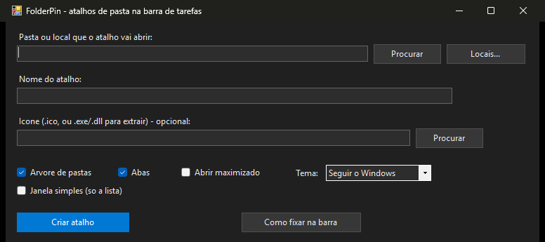
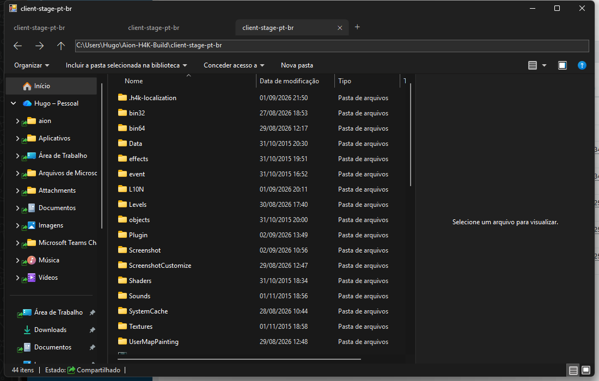
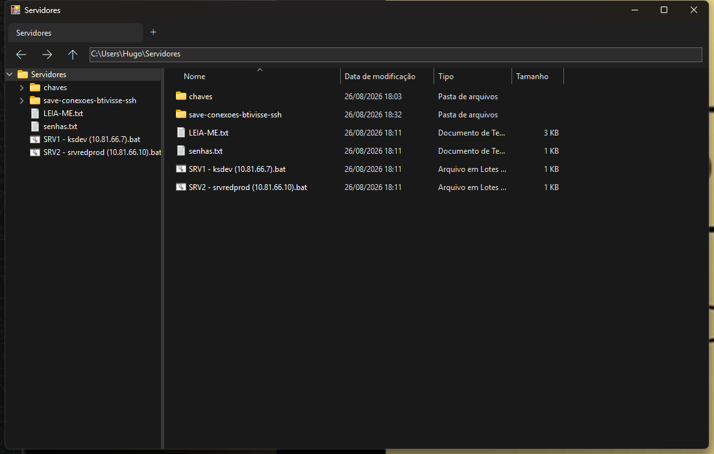
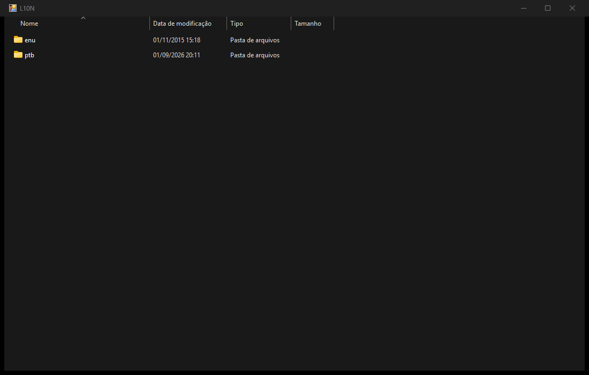
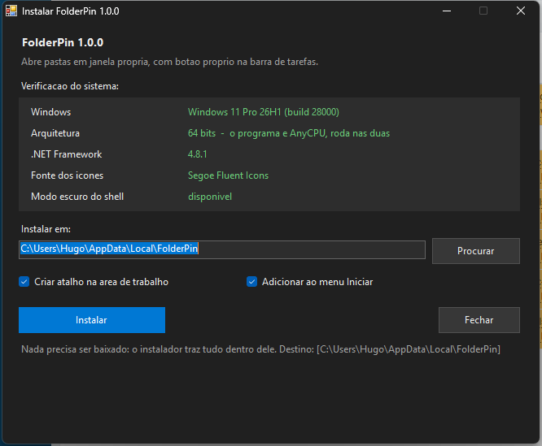

# Firaw - TaskBar

Fixa uma **pasta** na barra de tarefas do Windows com **botão próprio**, ícone próprio e janela própria — em vez de cair tudo no botão do Explorador de Arquivos.



## O problema

Você fixa um atalho `explorer.exe "C:\alguma\pasta"` na barra. Funciona: clica e abre. Mas a janela **não acende no seu ícone** — ela vai para o botão do Explorador de Arquivos, junto com todas as outras.

Não é bug seu. Toda janela de pasta é servida pelo processo `explorer.exe`, com o mesmo AppUserModelID (`Microsoft.Windows.Explorer`), e a barra de tarefas agrupa por esse identificador. Nada no Windows muda isso:

- **"Abrir janelas de pasta em um processo separado"** (Opções de Pasta) cria outro processo, mas o AppUserModelID continua o mesmo
- **AppUserModelID explícito no atalho** só vale para processo novo — a janela de pasta é atendida pelo `explorer.exe` que já estava rodando
- **"Nunca combinar"** separa janelas rotuladas, não dá pin próprio para a pasta

Para a pasta ter botão próprio, o dono da janela precisa **não ser o Explorador**.

## A solução

O Firaw - TaskBar abre a pasta numa janela dele, hospedando o **`IExplorerBrowser`** — a mesma view de pasta que o Explorador usa. Menu de contexto real, renomear, arrastar-e-soltar, miniaturas, tudo do shell. Só que o processo é outro:

- botão próprio na barra, no lugar dele
- ícone seu, inclusive com a janela aberta
- cada atalho ganha uma cópia própria do programa (~26 KB) — caminho de executável distinto é o que dá AppUserModelID distinto

## Baixar

| Arquivo | Para quê |
|---|---|
| [**Firaw-TaskBar-Setup.exe**](https://github.com/firawynix/folderpin/releases/latest/download/Firaw-TaskBar-Setup.exe) | **Comece por aqui.** Instalador completo: verifica o sistema, instala, cria atalhos e registra desinstalação |
| [Firaw-TaskBar-Studio.exe](https://github.com/firawynix/folderpin/releases/latest/download/Firaw-TaskBar-Studio.exe) | Só o configurador, sem instalar (portátil) |
| [Firaw-TaskBar.exe](https://github.com/firawynix/folderpin/releases/latest/download/Firaw-TaskBar.exe) | Só o motor da janela, para usar direto na linha de comando |
| [Firaw-TaskBar-1.3.1-x86_64.AppImage](https://github.com/firawynix/folderpin/releases/latest/download/Firaw-TaskBar-1.3.1-x86_64.AppImage) | Versão portátil para Linux x64 |
| [Firaw-TaskBar-1.3.1-amd64.deb](https://github.com/firawynix/folderpin/releases/latest/download/Firaw-TaskBar-1.3.1-amd64.deb) | Pacote para Ubuntu, Debian e derivados x64 |

Sem assinatura de código: o SmartScreen avisa na primeira vez. **Mais informações › Executar assim mesmo**.

## Requisitos

- Windows 10 ou 11 (funciona no 8.1; abaixo do build 17763 cai no tema claro)
- .NET Framework 4.x — já vem no Windows 10 1903+ e no 11
- 32 ou 64 bits: os binários são **AnyCPU**, o mesmo arquivo serve nos dois

Não precisa de administrador. Novas instalações usam `%LOCALAPPDATA%\Firaw - TaskBar`; uma instalação antiga continua no local anterior para preservar os atalhos já fixados.

## Como usar

1. abra o **Firaw - TaskBar Studio**
2. **Procurar** a pasta (ou **Locais...** para Este Computador, Rede, Lixeira e afins)
3. escolha ícone, se quiser — aceita `.ico`, ou um `.exe`/`.dll` de onde ele extrai
4. **Criar atalho** — ele nasce na área de trabalho
5. botão direito no atalho › **Mostrar mais opções** › **Fixar na barra de tarefas**

O passo 5 é manual porque a Microsoft **bloqueou o comando de fixar para programas** desde o Windows 10 1903. Nenhum aplicativo consegue fazer isso por você.

Para mudar um atalho depois: **2 cliques** nele na lista, ajuste, **Salvar alterações**. Atualiza o atalho da área de trabalho e o fixado na barra de uma vez.

## Opções de cada atalho

| Opção | O que faz |
|---|---|
| Árvore de pastas | painel de navegação na lateral, igual ao do Explorador |
| Árvore só desta pasta | a árvore **começa na pasta escolhida**: nada de Este Computador, OneDrive ou Rede em cima |
| Mostrar também os arquivos | com a árvore de raiz própria, os arquivos soltos aparecem nela junto das subpastas |
| Abas | tira de abas, cada uma com histórico e seleção próprios |
| Janela simples | lista com apenas os botões **Voltar** e **Avançar**: sem endereço, abas ou árvore |
| Abrir maximizado | abre ocupando a tela |
| Tema | Seguir o Windows (padrão), Sempre escuro, Sempre claro |
| Exibição | **Lembrar o que eu escolher** (padrão) ou um modo fixo: Detalhes, Lista, Blocos, Conteúdo, Ícones pequenos/médios/grandes/extra grandes |



Árvore só desta pasta, com os arquivos:



Nesse modo a lateral é um `INameSpaceTreeControl` próprio, com a raiz na sua pasta — o painel do `IExplorerBrowser` sempre nasce na Área de Trabalho e não aceita outra raiz. Entrar numa subpasta pela lista abre o caminho na árvore; clicar num arquivo leva a lista até a pasta dele. A cor da lateral segue a do Windows: o mesmo fundo da lista, ou o tom da cor de destaque quando "Mostrar cor de destaque em barras de título e bordas de janela" está ligado.

Janela simples, para quem quer só a pasta:



## Modo de exibição

Três formas de decidir como a pasta aparece — e a escolha não se perde ao fechar a janela:

- **no atalho**, antes de criar: campo **Exibição**, no configurador
- **na janela**, com o botão direito no fundo da lista › **Exibir**
- **na janela**, pelo teclado: `Ctrl+Shift+1` a `Ctrl+Shift+8`, na mesma ordem do Explorador

Com **Lembrar o que eu escolher** (o padrão), cada pasta guarda o que você deixou nela — modo, tamanho de ícone, colunas e ordenação — e volta assim na próxima vez. O estado fica em `HKCU\Software\Classes\Local Settings\Software\Microsoft\Windows\Shell\Bags\<n>\FolderPin`, nome interno legado preservado para não perder preferências: mexer na exibição aqui não mexe no Explorador, e vice-versa.

Escolhendo um **modo fixo**, ele vale para toda pasta que a janela abrir, inclusive as subpastas — e é reaplicado a cada navegação. Trocar a exibição na janela nesse caso dura até a próxima pasta.

Sem estado salvo e sem modo fixo, a pasta abre em Detalhes.

## Locais do Windows

Este Computador, Rede e Lixeira não têm caminho de disco, então o campo aceita nomes do shell:

```
shell:MyComputerFolder
shell:NetworkPlacesFolder
shell:RecycleBinFolder
shell:UsersFilesFolder
::{20D04FE0-3AEA-1069-A2D8-08002B30309D}
```

O botão **Locais...** traz 18 prontos. Para esses, o ícone sai do próprio Windows automaticamente.

## Atalhos de teclado

| Tecla | Ação |
|---|---|
| `Alt+←` / `Alt+→`, `Backspace` | voltar / avançar |
| `Alt+↑` | subir um nível |
| `Ctrl+L` / `F6` | focar a caixa de caminho |
| `F5` | atualizar |
| `Ctrl+A` | selecionar todos os itens |
| `Ctrl+C` / `Ctrl+X` / `Ctrl+V` | copiar / recortar / colar arquivos e pastas |
| `Ctrl+Z` / `Ctrl+Y` | desfazer / refazer operações aceitas pelo shell |
| `F2` | renomear o item selecionado |
| `Delete` / `Shift+Delete` | excluir / excluir permanentemente |
| `Enter` / `Alt+Enter` | abrir / mostrar propriedades |
| `Shift+F10` | menu de contexto do item selecionado |
| `Ctrl+T` | nova aba (na pasta atual) |
| `Ctrl+W` | fechar aba |
| `Ctrl+Tab` | próxima aba |
| `Ctrl+1`…`Ctrl+9` | ir para a aba N |
| `Ctrl+Shift+1`…`Ctrl+Shift+8` | modo de exibição: ícones extra grandes, grandes, médios, pequenos, lista, detalhes, blocos, conteúdo |
| Botões laterais do mouse | voltar / avançar |

## Linha de comando

```
Firaw - TaskBar.exe "C:\pasta" [opções]

  --icon <arquivo>   .ico, ou "arquivo,índice" (ex.: imageres.dll,-109)
  --aumid <id>       AppUserModelID explícito
  --no-tree          sem painel de navegação
  --tree-root        árvore com a raiz nesta pasta (só ela e o que está dentro)
  --tree-files       o mesmo, com os arquivos soltos na árvore (implica --tree-root)
  --no-tabs          sem abas
  --simples          só a lista, sem barra nem abas
  --view <modo>      lembrar (padrão) | detalhes | lista | blocos | conteudo |
                     icones-pequenos | icones-medios | icones-grandes |
                     icones-extra | auto
  --dark | --light   força o tema (padrão: seguir o Windows)
  --max              abre maximizado
  --debug            grava %TEMP%\firaw-taskbar.log
```

## Instalador



Verifica versão do Windows, arquitetura, .NET Framework, fonte de glifos e disponibilidade do modo escuro do shell — e diz o que acontece quando algo falta, em vez de quebrar. Registra em **Configurações › Aplicativos instalados**, com desinstalação que remove programas, atalhos e a chave do registro.

O instalador carrega os outros dois programas embutidos como recurso: é **um arquivo só**, não baixa nada.

**Atualizar** troca também a cópia do motor que cada atalho já criado usa — senão os atalhos antigos continuariam na versão anterior. Atalho com janela aberta na hora fica de fora, e o instalador diz quantos foram.

## Limites conhecidos

- **Fixar na barra é manual** (bloqueio da Microsoft, explicado acima)
- **Binários sem assinatura**: SmartScreen avisa na primeira execução
- Com a árvore **do shell** ligada, o shell traz junto a faixa dele (*Organizar / Incluir na biblioteca / …*) — é a barra da era Windows 7, embutida no `IExplorerBrowser`; a API não expõe como esconder
- Sem barra de busca e sem ribbon moderno
- Trocar o ícone de um atalho **já fixado** só aparece depois de reiniciar o Explorador
- Instalador escrito em .NET não consegue instalar o próprio .NET: numa máquina sem nenhum .NET Framework 4.x ele nem abre

## Compilar

Não precisa de Visual Studio nem SDK — o compilador C# já vem no Windows:

```cmd
build.cmd
```

Gera `Firaw - TaskBar.exe`, `Firaw - TaskBar Studio.exe` e `Firaw - TaskBar Setup.exe` com o `csc.exe` do .NET Framework 4.x.

| Arquivo | O que é |
|---|---|
| `FolderPin.cs` | a janela: hospeda `IExplorerBrowser`, abas, tema escuro, navegação |
| `FolderPinStudio.cs` | o configurador: cria, edita e remove atalhos |
| `FolderPinSetup.cs` | o instalador/desinstalador, com os dois acima embutidos |

## Detalhes que custaram caro

Anotados porque são armadilhas reais de shell no Windows:

- **`Icon` do .NET não decodifica quadro PNG dentro de `.ico`** e devolve chuvisco. Ícones modernos são PNG por dentro. A saída é `PrivateExtractIcons`, que usa o decodificador do shell
- **Modo escuro do shell** não tem API pública: é `SetPreferredAppMode` (uxtheme, ordinal 135) + `FlushMenuThemes` (136), chamados **antes** de criar a janela, mais `DwmSetWindowAttribute(20)` para a barra de título
- **Definir `Width` no construtor dispara `OnResize`** antes dos controles existirem — um `null` ali estoura como `0xC0000005` "módulo desconhecido", com cara de erro nativo
- **Dois atalhos apontando para o mesmo `.exe` colapsam num botão só**, porque o AppUserModelID sai do caminho do executável. É o mesmo motivo de perfil do Chrome precisar de AUMID próprio
- **A árvore do `IExplorerBrowser` (`EBO_SHOWFRAMES`) não muda de raiz.** Para começar na pasta escolhida é preciso hospedar o `INameSpaceTreeControl` (o mesmo controle do Explorador) e chamar `AppendRoot` com o `IShellItem` dela — o browser fica sem a faixa e a árvore vira controle próprio, com divisor arrastável
- **A seleção dessa árvore é lida por relógio, não por evento**: `INameSpaceTreeControlEvents` tem 18 métodos e errar a ordem da tabela derruba o processo. Um `GetSelectedItems` a cada 250 ms custa nada e não arrisca nada
- **O `IExplorerBrowser` não guarda estado de view nenhum** enquanto não se chamar `SetPropertyBag` (antes do `Initialize`) com um nome próprio. Sem isso toda janela nasce igual, não importa o que a pessoa escolha
- **O `DefView` hospedado mantém o cabeçalho de colunas até em modo de ícones** — a faixa "Nome / Data / Tipo / Tamanho" sobrando em cima das miniaturas. Quem desliga é a flag `FWF_NOHEADERINALLVIEWS` (`0x1000000`), no `FOLDERSETTINGS` e no `IFolderView2::SetCurrentFolderFlags`
- **Tamanho de ícone não cabe em `FOLDERSETTINGS`**: "ícones grandes" e "ícones médios" são o mesmo `FVM_ICON`. O que separa os dois é `IFolderView2::SetViewModeAndIconSize` (16 / 48 / 96 / 256) — e a interface tem 34 métodos até lá, todos na ordem exata da vtable
- **O modo fixo é aplicado em `OnViewCreated`**, com a view ainda vazia. Aplicar depois, com a lista montada, deixa rastro do modo anterior na tela
- **`Ctrl+Shift+1..8` não é do `DefView`**, é do frame do Explorador: hospedado, ninguém trata esses atalhos. Aqui eles são tratados na janela — e o `Ctrl+N` das abas passou a exigir *sem* Shift, senão engolia o atalho do shell
- **`TVM_SETBKCOLOR` pinta o fundo da árvore**, que por padrão não acompanha a cor de destaque; a cor sai de `HKCU\Software\Microsoft\Windows\DWM\AccentColor` (em ABGR) e é reaplicada em `WM_DWMCOLORIZATIONCOLORCHANGED`

## Licença

MIT — veja [LICENSE](LICENSE).
